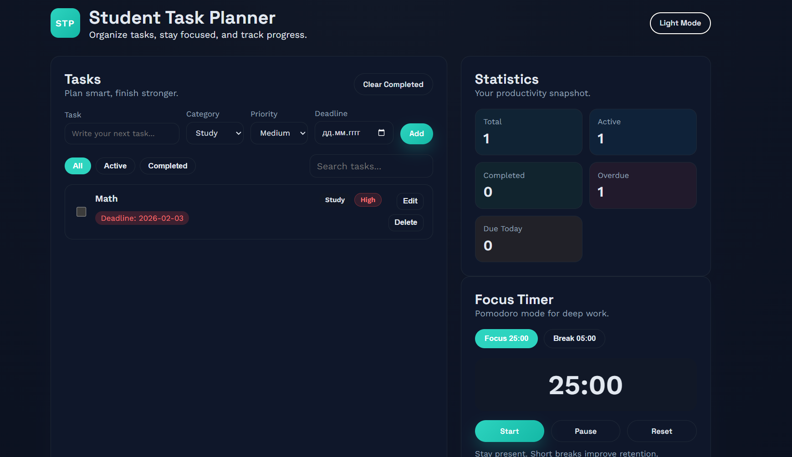

# Student Task Planner

A simple web application for managing daily tasks and improving productivity for students.

## Features
- Add, edit and delete tasks
- Task categories and priorities
- Deadline tracking
- Statistics (total, active, completed, overdue, today)
- Dark mode
- Focus Timer (Pomodoro)

## Live Demo
https://student-task-planner.github.io

## Screenshots

Main Interface:

Dark Mode & Timer:

## Technologies
- HTML
- CSS
- JavaScript
- LocalStorage

## How to run locally
1. Download or clone this repository
2. Open `index.html` in your browser

## Project purpose
This project was created as a university assignment to practice:
- Web development
- JavaScript logic
- UI design
- Working with LocalStorage

## Future improvements
- User authentication
- Cloud data storage
- AI assistant
- Mobile app version
